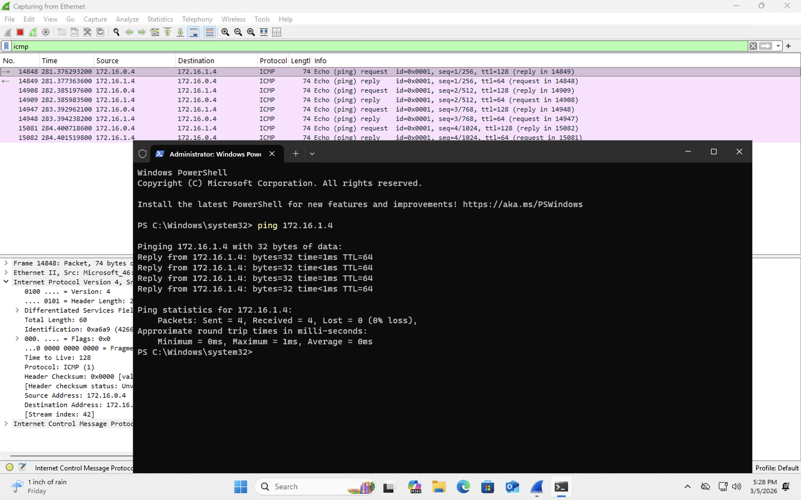
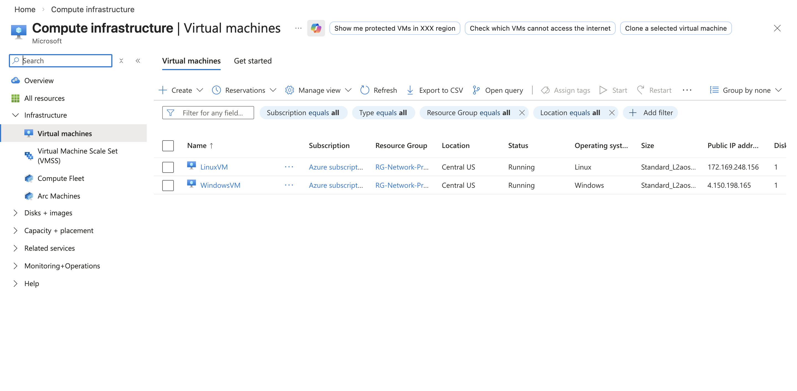
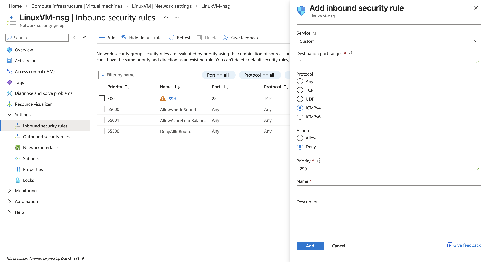
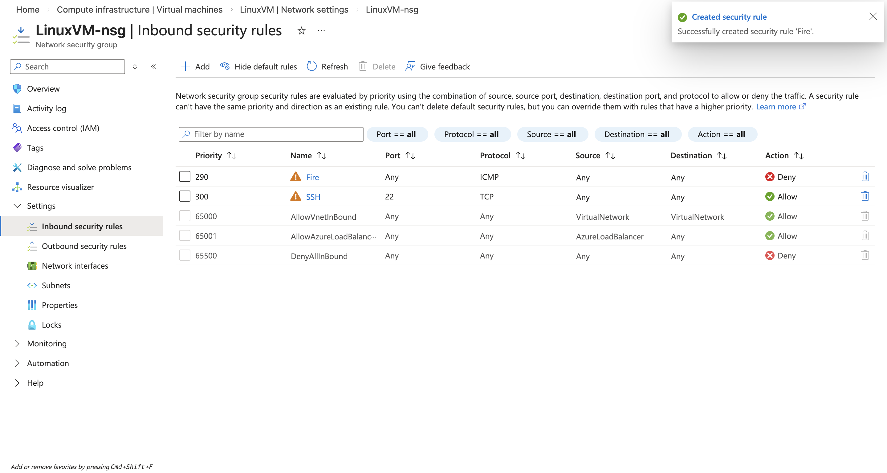
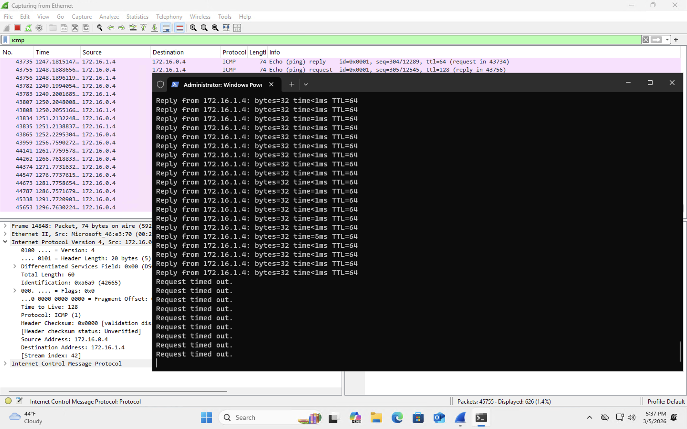
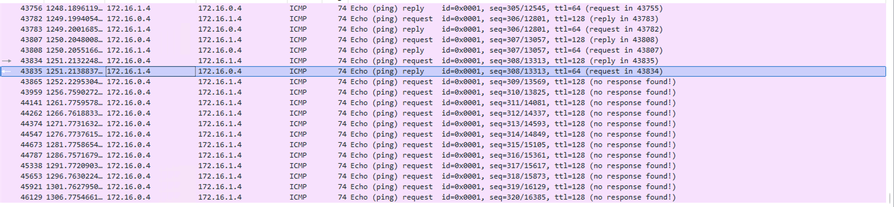
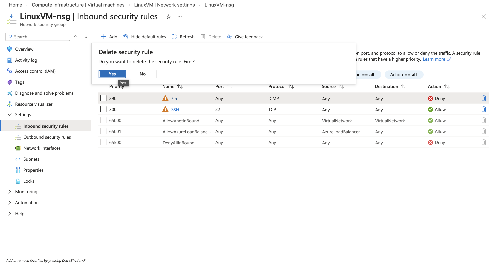
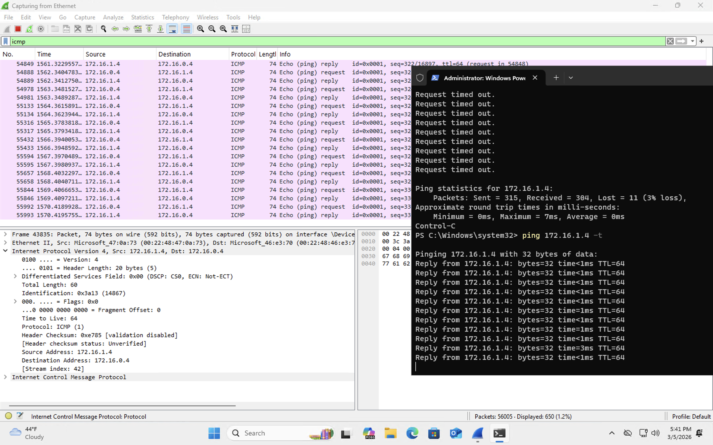

<h2>ICMP Traffic Analysis</h2>

<h3>Understanding ICMP</h3>

Before analyzing ICMP traffic in Wireshark, it is important to understand what <b>ICMP (Internet Control Message Protocol)</b> is and why it exists.

ICMP is a network protocol used primarily for diagnostics and communication between devices on a network. Unlike protocols such as TCP or UDP that carry application data, ICMP is mainly used for sending error messages and network status information.

One of the most common tools that uses ICMP is the <b>ping</b> command.

When a user runs the ping command, the system sends an <b>ICMP Echo Request</b> packet to another device on the network. If that device is reachable, it responds with an <b>ICMP Echo Reply</b>. This exchange allows us to verify that two devices can communicate across the network.

Network administrators and security analysts frequently analyze ICMP traffic when troubleshooting connectivity issues or investigating suspicious network behavior.

<h3>Generating ICMP Traffic</h3>

To observe ICMP packets in Wireshark, ICMP traffic must first be generated. In this lab environment, the Windows virtual machine was used to send ICMP requests to the Linux virtual machine.

The private IP address of the Linux machine was used as the destination.

The following command was executed in PowerShell:

<b>ping 172.16.1.4</b>

As the command runs, the Windows machine sends ICMP Echo Request packets to the Linux machine. If the Linux machine is reachable, it responds with ICMP Echo Reply packets.

This exchange confirms that both machines can communicate within the virtual network.

<h3>Filtering ICMP Traffic in Wireshark</h3>

To focus only on ICMP packets in Wireshark, the following display filter was applied:

<b>icmp</b>

This filter allows Wireshark to display only ICMP packets while hiding all other network traffic captured on the interface.

Once the filter is applied, we can clearly see ICMP Echo Requests and Echo Replies occurring between the two virtual machines.

<h3>Observing ICMP Requests and Replies</h3>

Within the Wireshark capture, ICMP Echo Requests originate from the Windows machine and are sent to the Linux machine. The Linux machine then responds with ICMP Echo Reply packets.

These request and reply packets confirm that communication between the two systems is functioning properly.

<h3>Blocking ICMP Traffic Using Network Security Rules</h3>

To demonstrate how network rules affect traffic, an inbound security rule was created on the Linux virtual machine to block ICMP traffic.

This rule denies ICMP packets from reaching the Linux machine.

Once the rule was applied, the Windows machine attempted to send additional ping requests.

Because the ICMP traffic was blocked by the network security rule, the ping command began returning <b>Request timed out</b> messages instead of receiving replies.

In Wireshark, we can see ICMP Echo Requests being sent, but no Echo Replies returning from the Linux machine.

This demonstrates how firewall or security rules can prevent communication between systems even when the devices exist on the same virtual network.

<h3>Restoring ICMP Connectivity</h3>

After confirming that ICMP traffic was successfully blocked, the deny rule was removed from the Linux virtual machine's network security group.

Once the rule was removed, ICMP traffic was allowed again and the ping command began receiving responses from the Linux machine.

Wireshark once again displayed both ICMP Echo Requests and ICMP Echo Replies, confirming that network communication had been restored.

This exercise demonstrates how ICMP traffic can be generated, observed, and controlled using network security rules in a cloud environment.

